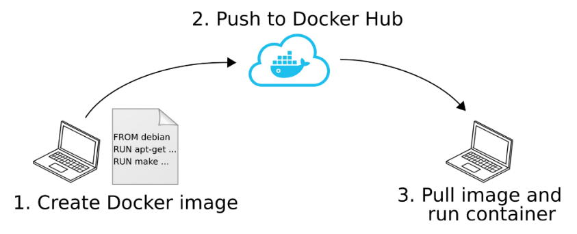

# Lab 4 - Introduction

## Install Docker

Search the WEB how to install Docker Engine on Ubuntu 24.04 from Docker's apt repository.

!!! Warning
    If you don't have Ubuntu, Docker Engine is available on Windows and MacOS via Docker Desktop

## Sign in

We will use Docker with a **Personal License** :  
[https://www.docker.com/products/personal/](https://www.docker.com/products/personal/)


Create an account to access the DockerHub (which contains many images to be run in containers)

## Docker Workflow



1. An image is created locally from a Dockerfile (file with all
instructions to build the image)
2. The image is pushed to a remote registry (e.g. DockerHub
maintained by Docker Inc.)
3. The image is pulled and the container is directly run on the
target computer (no install !!!)

## Docker : specific network configuration


**When working @ ENSTA Brest, the standard Docker network
addresses range (172.17.0.0/16) is conflicting with the intranet
network (gitlab, aurion, ...)**

*Reason* : When you install Docker, it automatically creates a default bridge network with the IP range 172.17.0.0/16. This means Docker containers connected to this network will be assigned IP addresses within this range (e.g., 172.17.0.2, 172.17.0.3, etc.).  
Issue, the intranet is already using the same IP range.

This can cause:

- Connectivity issues between containers and local machines.
- Routing problems if both networks try to use the same IP addresses.


Hence, we need to change the Docker network addresses range, for
example to 172.12.0.1/24

Stop docker and remove network interface docker0
``` bash
sudo systemctl stop docker
sudo ip link del docker0
```

Edit Docker config file `/lib/systemd/system/docker.service`
``` bash
sudo nano /lib/systemd/system/docker.service
```
Add `--bip "172.12.0.1/24"` at the end of the line starting with `ExecStart=/usr/bin/dockerd`  
Save the file, reload daemon and restart Docker

``` bash
sudo systemctl daemon-reload
sudo systemctl start docker
```