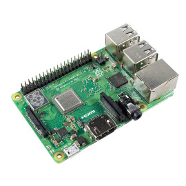

# Lab 1 - Introduction

## Objectives

**Setting-up Raspberry Pi OS Image**

1. Getting the Raspberry Pi OS (formerly Raspbian) image
2. Modifying the image on the host OS (ex. increasing size, changing settings)
3. Executing commands on the image on the host computer (ex.
adding a sudo user, raspi-config)

!!! Note
    The host or the host computer is the physical machine on
    which you will execute the Raspberry Pi OS. In this lab it is your
    laptop.

## Raspberry Pi 3B

Overview :

- The Raspberry Pi is a small single-board computer developed
in the UK by the Raspberry Pi Foundation.
- The Raspberry Pi 3 Model B is one of the most popular
versions.
- It offers a low-cost, compact solution for various computing
projects.

Specifications :

- CPU: Quad-core 1.2GHz Broadcom BCM2837 64-bit ARM
Cortex-A53 processor
- RAM: 1GB LPDDR2
- Connectivity:
- 4 USB 2.0 ports
- 1 HDMI port
- 1 Ethernet port
- 3.5mm audio jack
- Wi-Fi 802.11n and Bluetooth 4.1
- GPIO: 40-pin GPIO header

Applications :

- Home automation
- Robotics
- IoT projects
- Media center
- Education
- Retro gaming console

## Linux on RPI

Very basic behavior description :

- Linux comes as an image file (Raspberry Pi OS, Ubuntu,
Fedora, Manjaro ARM, ...)
- We will use the official image Raspberry Pi OS
- On real boards, the image is written on a SD-CARD
- The Raspberry Pi OS image contains 2 partitions : boot and
rootfs
- The boot partition contains all the important elements for
starting linux : boot loader (bootcode.bin), Device Tree Blob
(.dtb) , kernel (kernelx.img), starting command (cmdline.txt) ,
configuration (config.txt) ...
- The rootfs partition contains file system : /etc /lib /usr/lib,
/bin /dev /opt /home ...

## Lab presentation

In this lab you are asked to follow given instructions. Sometimes, you will meet issues you need to solve.  
There are tips to help you.  

The solutions will be displayed after the class.