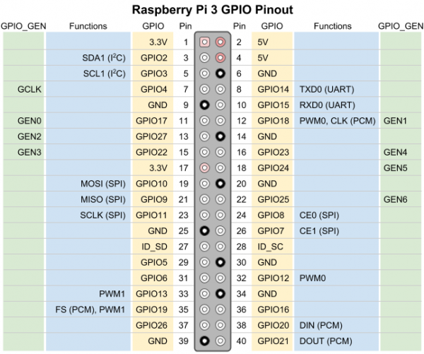

# B. Accessing the headless RPI without network

## Headless Raspberry Pi

For convenience or to save space and money, we don't want to use additional hardware components such as a monitor, keyboard, or mouse to access our Raspberry Pi, especially with a desktopless OS such as our Lite version of Raspberry Pi OS.  
We call this screenless setup a headless Raspberry Pi.  

There are different ways to configure a headless Raspberry Pi, here are three :

- **Serial Terminal** - This requires extra hardware in the form of a serial-to-USB adapter, but it is by far the most robust way to connect, as you are not relying on any network setup.
- **Ethernet with Static IP Address** - This method requires a Linux operating system to change some files on the Raspberry Pi image. You can give the Raspberry Pi a static IP address and then use an Ethernet cable (or WiFi) to log in.
- **WiFi with DHCP** - You will need to have access to your router to find your Raspberry Pi's IP address in order to log in via SSH. As a result, this may not be the best option in school or office environments.


If you would like to access your Raspberry Pi using the least amount of software work or without network, you will need some extra hardware. Two of the pins on the Raspberry Pi offer transmit and receive data for serial communication. With a small change to a file on the boot sector of the SD card, a command line terminal will be broadcast over this serial line, and you can enter commands to control Linux, write programs, etc.

If the other methods do not work to gain access to your Raspberry Pi or you lose your video out signal, using the serial terminal is a great way to see if your Raspberry Pi is still working and to debug any problems you might have.

You will need a USB to serial converter for this to work.


## Enable serial interface and login shell over serial

In versions of the Raspberry Pi after 3 (e.g. 3 Model B, 3 Model B+, Zero W), the processor contains two hardware UARTs. One is dedicated to the Bluetooth module, while the other is a less-featured "mini UART."

The serial interface is not enabled by default on the board, but we have already enabled it in Lab 1.

!!! Warning
    If Lab 1 made you use `raspi-config` to enable UART, it may have failed even if your setup was correct.  
    In fact, `raspi-config` needs a real Raspberry Pi kernel to work well, and QEMU is not sufficient.  
    But good news, most things `raspi-config` does are just file edits, so we can do it safely manually.

We will make sure the serial interface is enabled :  

- Plug your sd-card and make sure its partitions are mounted  
- Look for a `config.txt` file in `/boot` and open it.
- Now check there is the line `enable_uart=1` under the `[all]` section, if that's not the case add it, save and exit.

The sd-card can now be unmounted from your computer.

## Connecting the debug console

!!! Warning
    Make sure the Raspberry Pi is off (not powered) before proceeding the following steps !

First, insert the sd-card in the Raspberry Pi

The console will be connected on the I/O ports on the RPI board
and on an USB input of the host computer.

The serial to USB adapter is a FTDI USB cable with 3, 4 or 6 ”Arduino like” terminations
to be plugged on the RPI board, you can find some information in
the data sheet of the cable :

- The one with 3 terminations : [https://www.mouser.fr/datasheet/2/163/DS_TTL-232R_RPi-267577.pdf](https://www.mouser.fr/datasheet/2/163/DS_TTL-232R_RPi-267577.pdf)
- The one with 6 terminations : [https://cdn.robotshop.com/media/s/spa/rb-spa-432/pdf/ftdi-cable-schematic-dev-09718.pdf](https://cdn.robotshop.com/media/s/spa/rb-spa-432/pdf/ftdi-cable-schematic-dev-09718.pdf)
- The one with 4 terminations : [https://www.adafruit.com/product/954?srsltid=AfmBOoploJ4nyapeY4tQLdr9ZWopzSrvJaUvqjKPwxA8N61XxzHrdqi4](https://www.adafruit.com/product/954?srsltid=AfmBOoploJ4nyapeY4tQLdr9ZWopzSrvJaUvqjKPwxA8N61XxzHrdqi4)

!!! Warning
    Caution! The GPIO pins on the Raspberry Pi are NOT 5V tolerant. That means you must use a 3.3V USB-to-serial converter.

Look at the GPIO pinout for the Raspberry Pi 3, and find the UART pins.
Plug the 3 necessary terminations of the FTDI USB cable on the board accordingly.




Now this is done, power up the board !

## Set-up the FTDI USB cable connection on a serial port of the host

First, let's get the name of the serial port on the host.
The /dev/ directory consists of files that represent devices that are attached to the local system.  

Before plugin the FTDI USB cable,  
check the system messages :

```bash
sudo dmesg
```
and list the devices :

```bash
ls /dev | grep "tty"
```

Now, plug the FTDI cable and check again. `dmesg` should tell you about a new connection and the devices list should display a new device

!!! Note "1 - Issue"
    Find the name of the serial port. It should be something like `/dev/tty*`  

!!! Note
    If you are using Windows, you will need to know the COM port number connected to your USB to serial adapter, which can be found in the Device Manager

<!-- !!! Tip "1 - Solution"

    The name of serial port should be something like /dev/ttyUSB0 -->

Check it works with :
```bash
stty -F <serial_port_name>
```

!!! Note
    If the command works only with sudo, you need to be added to the dialout group.  
    First, check the groups you are member of :
    ```bash
    groups
    ```
    If dialout is not in the list , do
    ```bash
    sudo usermod -a -G dialout $USER
    ```
    and restart the computer ... or not !!!
    if you don’t want to restart the session, remember this trick
    ```bash
    su - $USER
    ```
    now dialout should be in the group list
    ```bash
    groups
    ```

## Access the RPI from the host

Once the RPI boot has booted, we can access it from the host with
tools like `minicom`.

the speed should be 115200 bauds
!!! Note "2 - Issue"
    Start minicom specifying the device name and a baudrate of 115200 using the correct options

<!-- !!! Tip "2 - Solution"

    ```bash
    minicom -b 115200 -D /dev/ttyUSB0
    ``` -->

!!! Note
    On windows use Putty is a straight-forward solution to connect to serial ports  
    If you still pefer using minicom under WSL, you need to use `usbipd` but it needs more setup

The first time using minicom, the "Hardware control flow" must be disabled :

- type ctrl-A the o to access the configuration
- select "Serial port setup"
- type F to disable Hardware Flow Control
- select "Save setup as dfl" so that next time you will not need to reconfigure
- finally select "Exit"

The login prompt should appear one or two minutes after powering
the RPI board. Type user and passwd to log in. You can use **ue41**
user you have created in Lab 1.

Check your hostname is the one you set in Lab 1 :

```bash
hostname
```


    
