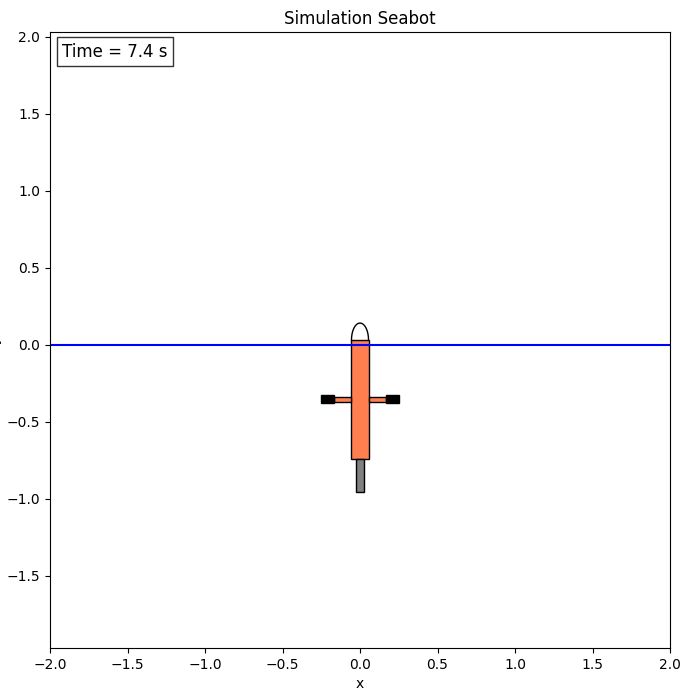

# C. Développement des algorithmes du Seabot

## Simulation

Si votre simulation fonctionne vous devriez observer une fenêtre de la sorte :



!!! Note "Problème n°3 (2 points)" 
    La simulation a été pensée pour que la position du piston puisse être controlée manuellement. Essayons.

    1. Dans le code source du noeud de simulation, trouvez à quels topics est abonné le noeud ROS de simulation et lequel permet de transmettre des consignes de commande manuelle du piston.
    2. Dans un premier terminal, lancez la simulation dans un conteneur. 
    3. Dans un second terminal, exécutez dans le même conteneur une commande permettant de controler la position du piston grâce au package ROS2 **teleop_twist_keyboard**.

    **Rendu attendu :**  
    La commande executant le controle manuel du robot dans le conteneur actif.

## Filtrage des mesures de pression

!!! Note "Problème n°4 (2 points)"
    Les mesures du capteur de pression sont bruitées. Afin d'obtenir une bonne régulation de la profondeur nous souhaitons filtrer ces valeurs.

    Créez un nouveau package `depth_filter` définissant un noeud de filtrage des mesures de pression publiées par le noeud de simulation.

    Deux bonnes pratiques pour les projets et codes ROS2 volumineux sont:

    - Définir la classe dans un fichier d'en-tête (header) `.h` ou `.hpp` et définir les méthodes de classe dans un fichier `.cpp`
    - Séparer les algorithmes des interfaces ROS2 : une classe qui définit l'algorithme et une classe qui définit le noeud ROS ayant elle même une instance de la classe précédente pour attribut.

    Le package `simulation` suit ces deux principes.  
    Ainsi, dans le package `depth_filter` on suivra la structure suivante :
    ```bash
    src/depth_filter
    ├── CMakeLists.txt
    ├── include
    │   └── depth_filter
    │       ├── depth_filter.hpp
    │       └── depth_filter_node.hpp
    ├── package.xml
    └── src
        ├── depth_filter.cpp
        └── depth_filter_node.cpp
    ```

    **TODO :**  
    Un squelette de code du package `depth_filter` est fourni. Il ne reste qu'à implémenter l'algorithme de filtrage. Un simple filtre moyenneur suffira.  
    Vous créerez aussi un nouveau message personnalisé `DepthPose` contenant les valeurs de profondeur et vitesse verticale filtrées.

    **Rendu attendu :**  
    Code source du package `depth_filter`

!!! Tip
    Le filtre moyenneur entraîne un retard sur la mesure filtrée.
    Notons la taille de la fenêtre de filtrage: **N**, et le temps entre chaque mesure: **dt**.  
    La mesure filtrée obtenu au temps **t_k** est la moyenne des N mesures précédentes. Elle aura un retard de **N/2*dt**.
    Il faut donc trouver un compromis sur la taille de la fenêtre entre la qualité du filtrage et le retard apporté.

!!! Tip
    L'avantage de séparer en deux classes le filtre en lui-même et les interfaces ROS2, c'est que nous pouvons utiliser le filtre indépendamment de ROS2.  
    Ainsi, vous pouvez tester votre algorithme indépendamment de la simulation.


## Controle de la profondeur

!!! Note "Problème n°5 (2 points)"

    De la même manière que précédemment, créez un nouveau package `depth_control` définissant un noeud de controle de la profondeur qui reçoit les mesures de pression filtrées et publient les consignes du piston.

    Ainsi, dans le package `depth_control` on suivra la structure suivante :
    ```bash
    src/depth_control
    ├── CMakeLists.txt
    ├── include
    │   └── depth_control
    │       ├── depth_control.hpp
    │       └── depth_control_node.hpp
    ├── package.xml
    └── src
        ├── depth_control.cpp
        └── depth_control_node.cpp
    ```

    Optez pour la loi de controle de votre choix. (bang-bang, PID, linéarisation par retour d'état, ...)  
    La performance de celle-ci n'entre pas dans la notation.

    **Rendu attendu :**  
    Code source du package `depth_control`.

## Launch

!!! Note "Problème n°6 (2 points)"

    Créez dans le package `seabot` un nouveau fichier launch **seabot_launch.py** pour lancer la simulation ET les algorithmes de filtrage et controle en même temps.

    Lancez les noeuds dans un conteneur.  
    Vous devriez observer le robot se stabiliser à sa consigne (définie par vous-même dans `depth_contol`, par exemple 10 m)

    **Rendus attendus :**  

    - le fichier launch
    - la commande `docker run` utilisée pour exécuter le launch dans un conteneur.

    