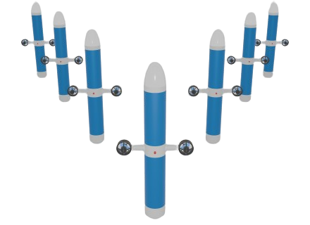

# A. Seabot Lab

!!! Note
    Ce mini-projet est ciblé pour Linux. Privilégiez l'utilisation d'un PC sous Linux.  

    Cela n'a pas été testé mais tout devrait pouvoir être fait, parfois par des moyens détournés, sur Windows et MacOS. Si vous rencontrez trop de soucis, associez vous avec un camarade sous Linux.

## Introduction

Dans ce mini-projet, vous allez mettre à l'épreuve vos connaissances en ROS2 et Docker pour développer une application conteneurisée de simulation d'un robot sous-marin.

Le robot, nommé **seabot** est un flotteur régulé uniquement en profondeur. Il est actionné par un moteur entraînant un piston sur une vis sans fin. La variation de volume permet au flotteur de modifier sa flottabilité et de réguler sa profondeur en se basant sur les mesures d'un capteur de pression.



## Rendus

A chaque problème posé, vous seront précisés les rendus attendus.
Au final vous rendrez sur moodle, compressé dans un fichier zip, un dossier structuré contenant **les rendus demandés pour chaque problème**.

!!! Note
    Le rendu du Lab 4 compte comme points bonus dans la note de ce mini-projet

## Contexte

Le robot est en phase de conception mécanique mais vous souhaitez déjà avancer sur l'intelligence embarquée sur le flotteur, en particulier sur les algorithmes haut-niveau.

L'un de vos collègues était en charge de développer une simulation du flotteur pour vous permettre de développer et tester vos algorithmes de navigation, observation, controle, ...

Vous vous apprêtez à récupérer la simulation sur votre machine et la tester pour la première fois.

## Initialisation

Vous créez un dossier de travail :

```bash
mkdir lab-seabot && cd lab-seabot
```

Votre collègue a rendu disponible le workspace ROS2 contenant le code source de la simulation sur Github :  
[https://github.com/tlefloch/lab-seabot-ros](https://github.com/tlefloch/lab-seabot-ros)

**Clonez le dépôt git dans votre dossier de travail.**

Afin d'obtenir un rendu graphique et visualiser en temps réel le comportement simulé du robot, votre collègue a développé une simulation avec une animation visuelle.  
Vous constatez que le workspace contient 4 packages, il vous explique le rôle de chacun :

- `animation` : génère une fenêtre graphique et actualise l'animation en fonction de l'état simulé du robot
- `seabot` : contient les scripts de launch et les fichiers de paramètres
- `seabot_msgs` : définit les messages personnalisés utiles au seabot
- `simulation` : simule la dynamique du robot
- `depth_filter`: un template de package pour filtrer des mesures de pression (à compléter par la suite)


Vous ne disposez que du code source, il faut donc le compiler.  
Votre machine est équippé d'une certaine version de ROS2. Vous vous apprêtez donc naturellement à utiliser `colcon build`:

Placez vous dans le workspace ROS2 :
``` bash
cd lab-seabot-ros
```

Et utilisez:
```bash
colcon build
```

A votre grande surprise vous obtenez une erreur !  
Vous allez consulter votre collègue qui ne comprend pas d'où vient l'erreur. Il tourne alors son écran vers vous et vous montre la compilation réussie sur son PC.  
Vous l'entendez alors prononcer la phrase tant redoutée:  

**"Mais ça marche sur ma machine..."**

