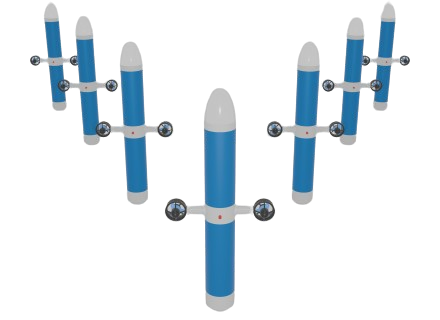

# Introduction

## Goal of the lab

- Practice on embedded Linux images
- Prepare an embedded Linux image from your computer for a real robot

---

## Application

In this lab, you will act as a robotics engineer preparing the onboard computer of an **Autonomous Underwater Vehicle (AUV)** : the **SEABOT**

Modern robots — especially mobile and marine robots — rely on small embedded computers such as the **Raspberry Pi** to run their software stack. These computers must be carefully prepared before deployment: the operating system needs to be installed, configured for headless operation, secured, networked, and equipped with the essential tools required for robotics development.

Instead of working directly on the physical robot, you will simulate this real-world workflow by:

- Creating a bootable **Ubuntu Server image**
- Configuring it from your personal computer
- Preparing the Operating System as if it were going to be deployed inside an AUV

!!! Note
    In this exercise, we work only on the main board of the robot which is a **Raspberry Pi 5**

---

## Assessment

Your work will be evaluated based on your ability to correctly prepare, configure, and document an embedded Ubuntu Server system suitable for robotic deployment.

You are expected to demonstrate:

- Proper installation of the Ubuntu Server image
- Proper mount and access to the image partitions from your computer
- Correct system configuration (users, hostname, networking, SSH, etc.)  
- Installation of required software tools
- Clear documentation of your steps and reasoning

Submit your work via a Git repository containing:

- A `README.md` written in **Markdown** containing answers to questions and used commands.
- Configuration files, scripts, or command logs when asked

Your documentation should be clear enough that another robotics engineer could reproduce your system from scratch. The git clarity will count in the notation.

!!! Warning
    **This assessment is due by Sunday, February 1st**
